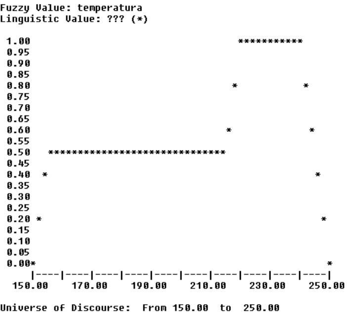

# Control Difuso de un Horno con FuzzyCLIPS  
**Ejercicio: Las galletas de la abuela María**

## Descripción del ejercicio

Este proyecto implementa un **sistema experto con control difuso** utilizando **FuzzyCLIPS** para regular automáticamente la temperatura de un horno durante la elaboración de las galletas caseras de la abuela María.

El sistema reproduce el razonamiento humano de la abuela María a partir de la observación del **índice cromático** de las galletas, un valor numérico entre **0 y 10**, donde:

- `0` → galletas crudas  
- `10` → galletas chamuscadas  

---

## Objetivo

- Definir los **conjuntos difusos** del índice cromático y de la temperatura del horno.
- Implementar la **base de conocimientos** (reglas difusas) y la **base de hechos** en **FuzzyCLIPS**.
- Ejecutar el sistema mediante **scripts CLIPS usando el comando `batch`**.
- Evaluar el sistema para un **índice cromático = 6**.
- Calcular la **temperatura final aplicada al horno** tras el proceso de inferencia y defuzzificación.

---

## Reglas del sistema experto

1. **Si** las galletas están *un poco crudas* → **entonces** la temperatura del horno debe ser *media*.
2. **Si** las galletas están *medio hechas* → **entonces** la temperatura del horno debe ser *alta*.
3. **Si** las galletas están *doraditas* → **entonces** la temperatura del horno debe ser *baja*.

---

## Conjuntos difusos

### Índice cromático de las galletas (0–10)

- **Un poco crudas**  
  `(1/4, 0.5/6, 0/7)`

- **Medio hechas**  
  `(0/3, 1/5, 1/6, 0/8)`

- **Doraditas**  
  `(0/5, 1/7)`

---

### Temperatura del horno (°C)

- **Baja**  
  `(0/150, 1/160, 1/180, 0/190)`

- **Media**  
  `(0/170, 1/190, 1/210, 0/230)`

- **Alta**  
  `(0/210, 1/220, 1/240, 0/250)`

---

### Ejecución en FuzzyCLIPS

La ejecución del sistema se realiza mediante un script, utilizando el comando batch desde la consola de FuzzyCLIPS.

**1. Iniciar FuzzyCLIPS**

Abrir el entorno de FuzzyCLIPS normalmente.

**2. Ejecutar el script principal**

En la consola de FuzzyCLIPS:

`(batch "galletas/run.clp")`

*NOTA*: los ficheros *.clp se encuentran en el directorio **galletas**.

Se ejecutarán los siguientes comandos:

Cargar la base de conocimientos y hechos

`(load "galletas/bc.clp")`

`(load "galletas/bh.clp")`

Reiniciar el sistema y ejecutar las reglas

`(reset)`

`(run)`

Operaciones FuzzyCLIPS

`(maximum-defuzzify 4)`

`(moment-defuzzify 4)`

Graficar el valor difuso

`(plot-fuzzy-value t * 150 250 4)`

---

### Caso de prueba

- **Entrada:**
Índice cromático de las galletas = 6

- **Salida:**
Valor numérico de la temperatura del horno obtenido tras:

  - Activación de las reglas difusas

  - Agregación de resultados

  - Defuzzificación

---

### Autores

- Ruyi Xia Ye
- Álvaro López Guerrero
- Juan Francisco Chacón Macías